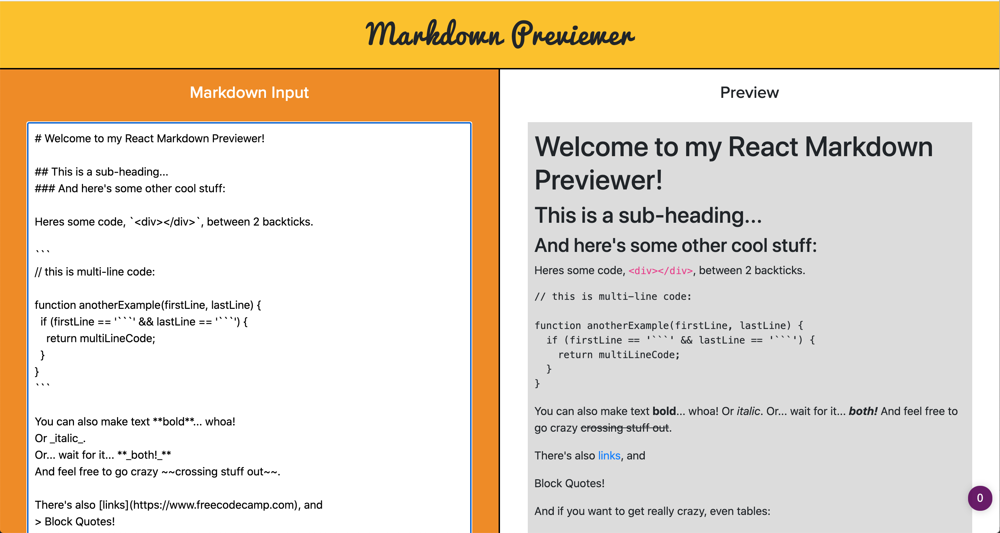
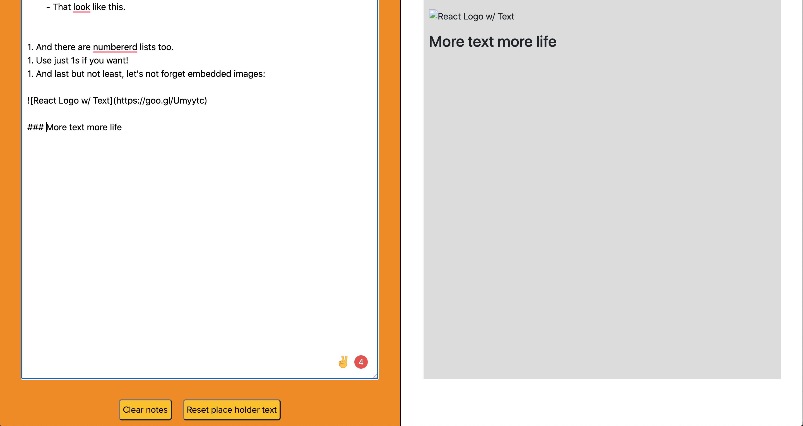

## Welcome to Simeron's Arcade! 🕹👾🎲🎮🃏

### Markdown Previewer 🎨✍🏽

### Simerons arcade is a series of litte mini applications. Design to help me learn and put all my learnings in one place. The arcade will bit filled with a varity of different types of apps (sorry they aren't all games! 😅) there will some games, calculators, and other everyday essential items that have been transformed with HTML / CSS / JS. I want to use this as a chance to me to upskill in a bitsized fashion and to use my love of design along the way. The design may now always be conventional... But hopefully it will always be with beautiful or fun!

### Enjoy!

#### How to use the Mark Down Previewer

1. Click into the markdown preview editor and delete the place holder text or use the 'clear notes' button.
2. See the text that you write appear in the preveiew window. Feel free to experient with different markdwon syntax
3. Use the 'clear notes' button below if you want to clear all of your text use the clear notes button at the botton of the editor
4. If you want to reset the place holder text then you can click on the 'reset place holder text' button and this will reset all of the notes back to the placeholder MarkDown notes

**Where I was inspired:**  I have been doing a lot of learning through 'Free Code Camp' and during my learning experience they suggest projects for you to build to help you build your skills. The Markdown Previewer was one of the suggestion. I wasn't completely confident about where to start so I did follow a tutorial which helped me a markdown previwer with class components which gave me a great base to start from. I then went on to change this and add my own features: 

**Refactoring from class componets to hooks** I refactored the code from class components to hooks, and removed the styling frame work from the demo and wrote my own pure CSS

**Setting placeholder text** The first feature I added was to add placeholder text to editor as this was one of the requirements from code camp and I thought this would give people a great place to start from and an idea of some of the avaliable tags.

**Clear notes button** I added a clear notes feature too, this is for anyone who would like to clear the notes they have written with ease and start over again

**Reset placeholder text button** This is another feature I added for anyone who maybe cleared all of the text in the beggining and would like to see that placeholder text again. 

**Accessibility:** You can use this markdown editor without a mouse, you can tab between and buttons and editor, and type the text you don't and not require a mouse at all.

;

## Markdown Previewer React README Docs set up for project

This project was bootstrapped with [Create React App](https://github.com/facebook/create-react-app).

### Available Scripts

In the project directory, you can run:

### `npm start`

Runs the app in the development mode. 
Open [http://localhost:3000](http://localhost:3000) to view it in the browser.

The page will reload if you make edits. 
You will also see any lint errors in the console.

### `npm test`

Launches the test runner in the interactive watch mode. 
See the section about [running tests](https://facebook.github.io/create-react-app/docs/running-tests) for more information.

### `npm run build`

Builds the app for production to the `build` folder. 
It correctly bundles React in production mode and optimizes the build for the best performance.

The build is minified and the filenames include the hashes. 
Your app is ready to be deployed!

See the section about [deployment](https://facebook.github.io/create-react-app/docs/deployment) for more information.

### `npm run eject`

**Note: this is a one-way operation. Once you `eject`, you can’t go back!**

If you aren’t satisfied with the build tool and configuration choices, you can `eject` at any time. This command will remove the single build dependency from your project.

Instead, it will copy all the configuration files and the transitive dependencies (webpack, Babel, ESLint, etc) right into your project so you have full control over them. All of the commands except `eject` will still work, but they will point to the copied scripts so you can tweak them. At this point you’re on your own.

You don’t have to ever use `eject`. The curated feature set is suitable for small and middle deployments, and you shouldn’t feel obligated to use this feature. However we understand that this tool wouldn’t be useful if you couldn’t customize it when you are ready for it.

## Learn More

You can learn more in the [Create React App documentation](https://facebook.github.io/create-react-app/docs/getting-started).

To learn React, check out the [React documentation](https://reactjs.org/).

### Code Splitting

This section has moved here: https://facebook.github.io/create-react-app/docs/code-splitting

### Analyzing the Bundle Size

This section has moved here: https://facebook.github.io/create-react-app/docs/analyzing-the-bundle-size

### Making a Progressive Web App

This section has moved here: https://facebook.github.io/create-react-app/docs/making-a-progressive-web-app

### Advanced Configuration

This section has moved here: https://facebook.github.io/create-react-app/docs/advanced-configuration

### Deployment

This section has moved here: https://facebook.github.io/create-react-app/docs/deployment

### `npm run build` fails to minify

This section has moved here: https://facebook.github.io/create-react-app/docs/troubleshooting#npm-run-build-fails-to-minify
